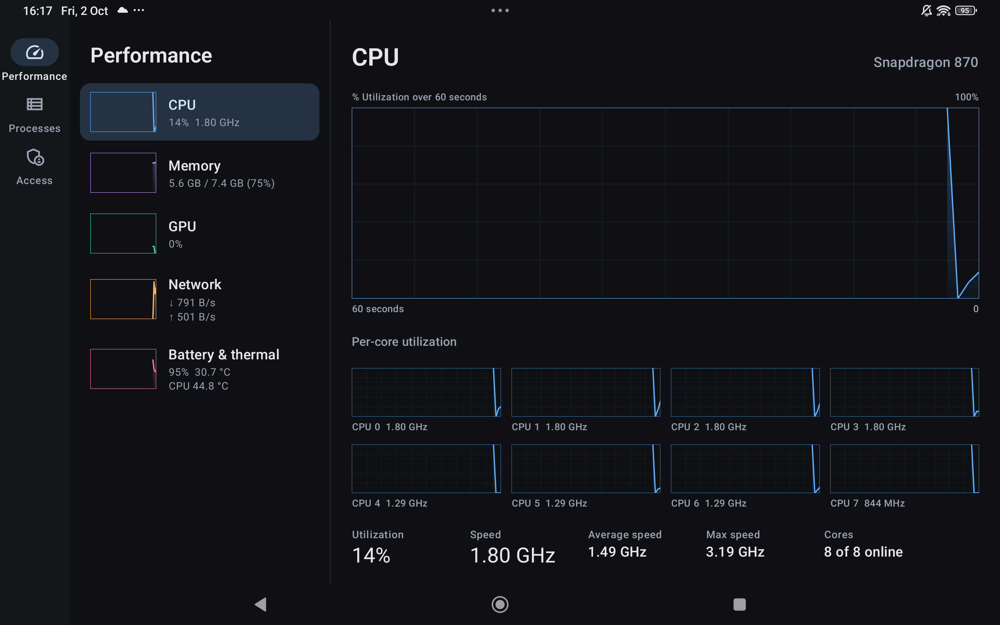

# Android Monitor (Preview)

[](https://github.com/TerminalDev-1/AndroidMonitor-Preview/actions/workflows/build.yml)

> [!WARNING]
> **This is a preview project with no guarantee of maintenance.**
> It may change, break, or stop being updated at any time, without notice.
> Use it as-is, and expect breaking changes between versions.

A modern, open-source system monitor for Android tablets and phones, inspired by the Windows Task Manager.



Live graphs for **CPU, GPU, memory, network, battery and temperatures**, plus a **process list** where you can see what's using your device and end tasks.

## ✨ Made for vibe coding

You don't need to know Kotlin, Android, or Gradle to use or change this app. If you like building things by chatting with AI, this repo is for you. Open your favorite AI coding tool (**[Claude Code](https://claude.com/claude-code)**, **[Codex](https://openai.com/codex/)**, or whatever you vibe with), describe what you want in plain words, and let it handle the technical parts.

The repo includes an [`AGENTS.md`](AGENTS.md) that briefs your AI on the setup, the device quirks, and the house rules, so it gets things right on the first try instead of guessing.

Not sure where to start? Paste one of these:

**Install it on my device**
```text
Clone https://github.com/TerminalDev-1/AndroidMonitor-Preview, follow its AGENTS.md
to install whatever toolchain I'm missing, build the app, and install it on my
Android device (it's connected with USB or wireless debugging).
```

**Unlock full stats with Shizuku**
```text
Help me set up Shizuku on my Android device so Android Monitor can show real CPU
usage and the process list. Walk me through the steps I have to do on the device.
```

**Add support for my device**
```text
Some stats in Android Monitor show "Not available" on my device. Use adb to find
which GPU and thermal files my device exposes, add support for them following
AGENTS.md, then rebuild and install so I can check.
```

**Make it yours**
```text
Read AGENTS.md, then add [your idea: a floating FPS overlay / a home-screen widget /
a battery history graph] to Android Monitor. Build it and install it on my device.
```

Prefer the APK? Grab it from [Releases](https://github.com/TerminalDev-1/AndroidMonitor-Preview/releases).

## Features

- **Performance view** with live 60-second graphs. On tablets, a sidebar of mini-graphs sits next to a large detail view, just like Task Manager.
- **CPU:** total and per-core utilization, clock speeds, core count, up time, and the chip name (for example "Snapdragon 870").
- **GPU:** utilization, frequency and temperature where the driver exposes them (Qualcomm Adreno, plus generic `/sys/kernel/gpu` drivers).
- **Memory:** usage, composition (in use / cached / free), zRAM swap, and storage.
- **Network:** receive and send throughput.
- **Battery & thermal:** charge, power draw, voltage, current, thermal status, and every thermal sensor.
- **Processes:** grouped by app, with icons, CPU and memory "heat" columns, search, sorting, and End task.
- Light and dark themes, and an adjustable refresh rate.

## Why Shizuku?

Since Android 8, regular apps can't read system-wide CPU usage or see other apps' processes. That's why most monitors on the Play Store show broken or fake numbers. Android Monitor has three modes:

| Mode | Setup | What you get |
|---|---|---|
| **Standard** | None | Memory, network, battery, CPU clock speeds, plus GPU and thermal where the device allows it. CPU usage is *estimated* from clock speeds and labelled as an estimate. |
| **Shizuku** (recommended) | Install [Shizuku](https://shizuku.rikka.app/) and start it with wireless debugging | Real CPU usage, per-core load, the process list, End task, all thermal sensors |
| **Root** | A rooted device | Same as Shizuku |

[Shizuku](https://github.com/RikkaApps/Shizuku) is a free, open-source app that lets other apps use ADB-level permissions without root. Android Monitor only uses it to **read** system files (`/proc`, `/sys`) and to run `am force-stop` when you tap End task.

## Building by hand

Prefer doing it yourself? Open the folder in [Android Studio](https://developer.android.com/studio) and press **Run**, or from a terminal with JDK 17 or 21:

```bash
./gradlew installDebug
```

[`AGENTS.md`](AGENTS.md) has the full details.

## Contributing

Issues and pull requests are welcome, and vibe-coded ones totally count. GPU and thermal file paths vary a lot between devices, so support for more devices is the most useful contribution. Use the "Add support for my device" prompt above, or open an issue with your device model.

## License

[MIT](LICENSE)
